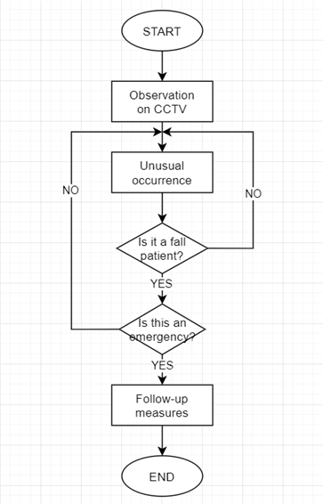

# 개별연구
YOLOv3 알고리즘을 이용한 실시간 낙상 검출
# Participants
* 이현동 - 팀장
* 윤종연
* 최수정
# Initial Design
## Flow Chart

## Pseudo Code
```
struct FallenPerson {
    yolo_detected_object obj;
    int elapsed_time;
    int elapsed_frame;
}

void main() {
    for frame_idx in video.length {
        img = get_img_from(video, frame_idx)
        object_list = detect_with_yolo(img)
        
        // 계층적으로, 사람 -> 넘어지는 중 -> 넘어져 있음 상태로 각각의 리스트를 저장하고, 매 프레임에 대하여 넘어져 있음 -> 넘어지는 중 -> 사람 의 순서로 연산을 수행
        for fallen_person in fallen_list { // 넘어져 있는 사람 리스트
            count_frame_and_time(fallen_person) // 넘어져있는 시간 계산

            if(fallen_person.elapsed_time >= EMERGENCY_TIME_THRESHOLD) { // 넘어지고 [긴급상황 경계값]초 이내로 일어나지 못한 경우
                if(tracking_list.length < HELPABLE_PEOPLE_COUNT) { // 주변에 [도와줄 수 있는 사람 수]가 부족한 경우
                    alert(fallen_person) // 해당 사람에 대하여 시스템에 알림
                    delete_from_list(fallen_list, fallen_person)
                }
            }
        }

        for falling_person in falling_list { // 넘어지는 사람 리스트
            update_track_loc(falling_person)
            if(falling_person.class changed to "FallenPerson") {
                // 넘어져 있음 감지
                FallenPerson fp = FallenPerson(falling_person, 0, 0)
                add_fallen_list(fp)
                delete_from_list(falling_list, falling_person)
            }
            
        }

        for tracked_obj in tracking_list { // 사람 리스트
            update_track_loc(tracked_obj)
            if(tracked_obj.class changed to "FallingPerson") {
                // 넘어짐 감지
                add_falling_list(tracked_obj)
                delete_from_list(tracking_list, tracked_obj)
            }
        }
        
        for obj in object_list {
            if(obj.class == "Person") {
                if(obj not in tracking_list) {
                    // 트랙 리스트에 없는 사람이 포착되면, 트랙 리스트에 추가
                    add_tracking_list(obj)
                }
            }
        }
    }
}
```